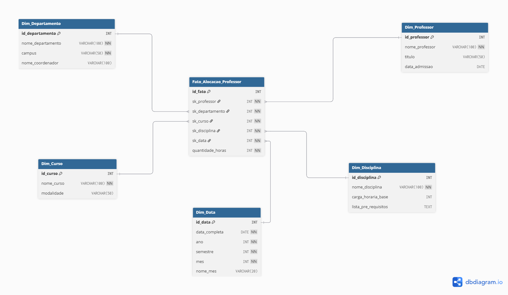

# Desafio: Star Schema para Cenário de Universidade

Este repositório contém a solução do desafio de modelagem dimensional de uma base de dados universitária, focada na análise da alocação de professores e carga horária.

## 📌 Objetivo do Projeto
Transformar um modelo relacional (ER) complexo em um **Star Schema** (Esquema em Estrela) para otimizar consultas analíticas sobre o corpo docente, departamentos e disciplinas.

## 🛠️ Decisões Arquiteturais

### 1. Foco no Professor
Conforme as instruções da transcrição, as entidades `Aluno` e `Matriculado` foram removidas do escopo para simplificar a análise e focar na produtividade e alocação dos professores.

### 2. Desnormalização (Achatamento)
Para garantir um modelo Estrela puro e evitar o formato *Snowflake* (floco de neve), aplicamos as seguintes técnicas:
- **Pré-requisitos:** A relação N:M de pré-requisitos foi desnormalizada. Agora, a `Dim_Disciplina` contém um atributo textual com a lista de requisitos.
- **Departamentos:** O nome do coordenador foi resolvido e inserido diretamente na `Dim_Departamento`, eliminando a necessidade de um auto-relacionamento circular com a tabela de professores na visualização dimensional.
- **Relacionamentos N:M:** Tabelas associativas (como Curso-Disciplina) foram absorvidas pela granularidade da **Tabela Fato**.

## 📐 Estrutura do Modelo

### Tabela Fato: `Fato_Alocacao_Professor`
- **Granularidade:** Um registro por professor, por disciplina, por curso e por semestre.
- **Métrica:** `quantidade_horas` (Carga horária da alocação específica).

### Tabelas de Dimensão
1. **`Dim_Professor`:** Dados cadastrais do docente.
2. **`Dim_Departamento`:** Informações sobre campus e gestão.
3. **`Dim_Curso`:** Detalhes dos cursos oferecidos.
4. **`Dim_Disciplina`:** Conteúdo programático e requisitos.
5. **`Dim_Data`:** Dimensão de tempo para análise histórica e semestral.

## 🚀 Como utilizar
1. O arquivo `script_star_schema.sql` contém o código DDL para criar a estrutura no seu banco de dados.
2. Você pode importar este script no **MySQL Workbench** ou ferramenta similar para gerar o diagrama visual automaticamente.

---
*Projeto desenvolvido como parte do desafio de modelagem de dados da formação Power BI.*
